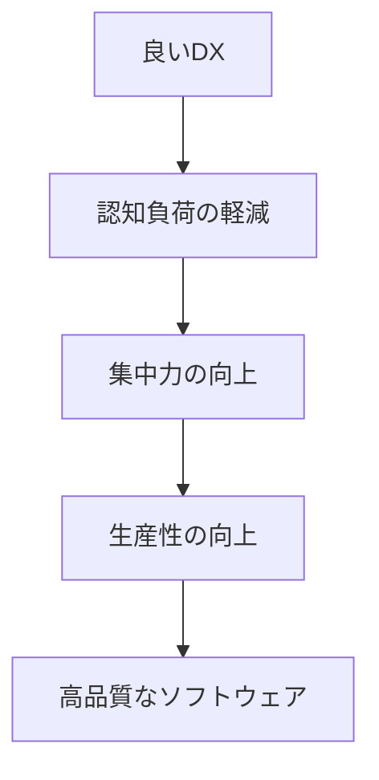
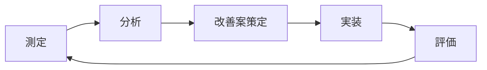

# 開発者体験（DX）の重要性と改善戦略

## 目次

1. [はじめに](#はじめに)
2. [DXとは何か](#dxとは何か)
3. [なぜDXが重要なのか](#なぜdxが重要なのか)
4. [DXの主要な要素](#dxの主要な要素)
5. [DX改善の具体的な戦略](#dx改善の具体的な戦略)
6. [ツールとテクノロジー](#ツールとテクノロジー)
7. [測定と評価](#測定と評価)
8. [成功事例](#成功事例)
9. [まとめ](#まとめ)

## はじめに

現代のソフトウェア開発において、**開発者体験（Developer Experience, DX）**は単なるトレンドワードを超えて、プロジェクトの成功を左右する重要な要素となっています。優れたDXは開発チームの生産性を向上させ、品質の高いソフトウェアの継続的な提供を可能にします。

本記事では、DXの本質的な価値から具体的な改善戦略まで、包括的に解説します。

## DXとは何か

### 定義

**開発者体験（DX）**とは、開発者がソフトウェアを設計、構築、デプロイ、保守する際の全体的な体験を指します。これには以下のような要素が含まれます：

- **開発環境の使いやすさ**
- **ツールチェーンの効率性**
- **ドキュメントの質**
- **学習コストの低さ**
- **問題解決の容易さ**
- **コラボレーションの質**

### UXとの違い

| 観点 | UX（User Experience） | DX（Developer Experience） |
|------|----------------------|---------------------------|
| 対象者 | エンドユーザー | 開発者 |
| 目的 | 製品の使いやすさ | 開発プロセスの効率化 |
| 評価指標 | ユーザー満足度、コンバージョン率 | 開発速度、エラー率、開発者満足度 |
| 影響範囲 | 製品の成功 | 開発チームの生産性 |

## なぜDXが重要なのか

### 1. 生産性の向上

優れたDXは開発者の**認知負荷**を軽減し、本質的な問題解決に集中できる環境を提供します。



### 2. 開発者の満足度とリテンション

- **ストレス軽減**: 煩雑な作業の自動化
- **成長機会**: 新しい技術への学習コストの削減
- **達成感**: スムーズな開発フローによる成功体験

### 3. ビジネス価値の向上

- **Time to Market の短縮**
- **品質向上によるバグ減少**
- **メンテナンスコストの削減**
- **イノベーションの促進**

## DXの主要な要素

### 1. 開発環境（Development Environment）

#### 特徴
- **一貫性**: 全開発者が同じ環境で作業
- **再現性**: 問題の再現と解決が容易
- **拡張性**: 新しいツールや技術の導入が簡単

#### 実装例
```bash
# Docker Composeを使用した開発環境の例
version: '3.8'
services:
  app:
    build: .
    ports:
      - "3000:3000"
    volumes:
      - .:/app
      - /app/node_modules
    environment:
      - NODE_ENV=development
  
  database:
    image: postgres:13
    environment:
      - POSTGRES_DB=myapp
      - POSTGRES_USER=developer
      - POSTGRES_PASSWORD=password
```

### 2. ツールチェーン（Toolchain）

#### CI/CDパイプライン
```yaml
# GitHub Actions の例
name: CI/CD Pipeline
on:
  push:
    branches: [main, develop]
  pull_request:
    branches: [main]

jobs:
  test:
    runs-on: ubuntu-latest
    steps:
      - uses: actions/checkout@v2
      - name: Setup Node.js
        uses: actions/setup-node@v2
        with:
          node-version: '18'
      - name: Install dependencies
        run: npm ci
      - name: Run tests
        run: npm test
      - name: Run linting
        run: npm run lint
```

### 3. ドキュメンテーション

#### 効果的なドキュメントの特徴
- **検索可能性**: 必要な情報を素早く見つけられる
- **実用性**: 実際の使用例とコードサンプル
- **最新性**: 定期的な更新とメンテナンス
- **アクセシビリティ**: 様々なレベルの開発者に対応

#### ドキュメント構造の例
```
docs/
├── README.md                 # プロジェクト概要
├── getting-started/          # 開始ガイド
│   ├── installation.md
│   ├── quick-start.md
│   └── configuration.md
├── api/                      # API ドキュメント
│   ├── authentication.md
│   ├── endpoints.md
│   └── examples.md
├── guides/                   # 詳細ガイド
│   ├── best-practices.md
│   ├── troubleshooting.md
│   └── deployment.md
└── contributing/             # 貢献ガイド
    ├── development.md
    ├── testing.md
    └── code-style.md
```

## DX改善の具体的な戦略

### 1. 自動化の推進

#### 繰り返し作業の自動化
```javascript
// package.json のスクリプト例
{
  "scripts": {
    "dev": "next dev",
    "build": "next build",
    "start": "next start",
    "lint": "next lint",
    "lint:fix": "next lint --fix",
    "test": "jest",
    "test:watch": "jest --watch",
    "test:coverage": "jest --coverage",
    "format": "prettier --write .",
    "type-check": "tsc --noEmit",
    "prepare": "husky install"
  }
}
```

#### Git フックの活用
```bash
#!/bin/sh
# .husky/pre-commit
. "$(dirname "$0")/_/husky.sh"

npm run lint
npm run type-check
npm run test
```

### 2. 開発者フィードバックループの短縮

#### Hot Reload の実装
```javascript
// Next.js の開発サーバー設定例
/** @type {import('next').NextConfig} */
const nextConfig = {
  experimental: {
    appDir: true,
  },
  // 開発時の高速リロード
  webpack: (config, { dev }) => {
    if (dev) {
      config.watchOptions = {
        poll: 1000,
        aggregateTimeout: 300,
      }
    }
    return config
  }
}

module.exports = nextConfig
```

### 3. エラーハンドリングとデバッグの改善

#### 意味のあるエラーメッセージ
```typescript
// 良い例: 具体的で解決策を示すエラーメッセージ
class ValidationError extends Error {
  constructor(field: string, value: any, expectedType: string) {
    super(
      `Invalid value "${value}" for field "${field}". ` +
      `Expected ${expectedType}. ` +
      `Please check your input and try again.`
    )
    this.name = 'ValidationError'
  }
}

// 使用例
if (typeof email !== 'string') {
  throw new ValidationError('email', email, 'string')
}
```

### 4. コードの品質と一貫性

#### ESLint設定例
```javascript
// eslint.config.mjs
import { FlatCompat } from '@eslint/eslintrc'
import js from '@eslint/js'
import typescriptEslint from '@typescript-eslint/eslint-plugin'
import typescriptParser from '@typescript-eslint/parser'

const compat = new FlatCompat({
  baseDirectory: import.meta.dirname,
})

export default [
  js.configs.recommended,
  ...compat.extends('next/core-web-vitals'),
  {
    files: ['**/*.ts', '**/*.tsx'],
    languageOptions: {
      parser: typescriptParser,
      parserOptions: {
        ecmaVersion: 'latest',
        sourceType: 'module',
      },
    },
    plugins: {
      '@typescript-eslint': typescriptEslint,
    },
    rules: {
      '@typescript-eslint/no-unused-vars': 'error',
      '@typescript-eslint/no-explicit-any': 'warn',
      'prefer-const': 'error',
      'no-console': 'warn',
    },
  },
]
```

## ツールとテクノロジー

### 開発環境管理
- **Docker & Docker Compose**: 環境の一貫性
- **Vagrant**: 仮想マシンベースの開発環境
- **Nix**: 宣言的な環境管理

### コード品質
- **ESLint**: JavaScript/TypeScript の静的解析
- **Prettier**: コードフォーマッター
- **SonarQube**: 包括的なコード品質分析
- **Husky**: Git フックの管理

### テスティング
- **Jest**: JavaScript テスティングフレームワーク
- **Cypress**: E2E テスト
- **Playwright**: クロスブラウザテスト
- **Storybook**: コンポーネントテスト

### ドキュメンテーション
- **GitBook**: インタラクティブなドキュメント
- **Docusaurus**: 静的サイトジェネレーター
- **Swagger/OpenAPI**: API ドキュメント

### モニタリングと観測
- **Sentry**: エラートラッキング
- **DataDog**: アプリケーション監視
- **Lighthouse**: パフォーマンス測定

## 測定と評価

### DXメトリクス

#### 定量的指標
```typescript
interface DXMetrics {
  // 開発速度
  deploymentFrequency: number        // デプロイ頻度
  leadTimeForChanges: number         // 変更のリードタイム
  timeToFirstHelloWorld: number      // 初回セットアップ時間
  
  // 品質指標
  changeFailureRate: number          // 変更失敗率
  meanTimeToRecovery: number         // 平均復旧時間
  bugReportCount: number             // バグ報告数
  
  // 開発者満足度
  developerSatisfactionScore: number // 開発者満足度スコア
  toolAdoptionRate: number           // ツール採用率
  documentationUsageRate: number     // ドキュメント利用率
}
```

#### 定性的評価
- **開発者アンケート**: 定期的な満足度調査
- **1on1ミーティング**: 個別フィードバック収集
- **レトロスペクティブ**: チーム全体での振り返り

### 継続的改善のプロセス



## 成功事例

### ケーススタディ 1: Netflix
**課題**: 大規模なマイクロサービス環境での開発効率
**解決策**: 
- 内製開発者プラットフォーム
- 自動化されたCI/CDパイプライン
- 包括的な監視とログ基盤

**結果**: デプロイ時間を数時間から数分に短縮

### ケーススタディ 2: Shopify
**課題**: 複数チームでの開発標準化
**解決策**:
- 統一された開発環境（Dev）
- 共通コンポーネントライブラリ
- 自動テストとコード品質チェック

**結果**: 新機能開発速度が30%向上

## まとめ

優れた開発者体験（DX）は、現代のソフトウェア開発において競争優位性を生み出す重要な要素です。

### 重要なポイント

1. **全体最適化**: 個別ツールではなく、開発プロセス全体の最適化
2. **継続的改善**: 定期的な測定と改善サイクル
3. **開発者中心**: 実際の開発者のニーズに基づいた改善
4. **自動化の推進**: 繰り返し作業の排除
5. **文化の醸成**: DXを重視する組織文化の構築

### 次のステップ

1. **現状評価**: 現在のDXレベルを測定
2. **優先順位付け**: 最も影響の大きい改善領域を特定
3. **段階的実装**: 小さな改善から始めて段階的に拡大
4. **フィードバック収集**: 定期的な開発者フィードバック
5. **継続的改善**: 測定結果に基づく継続的な改善

DXの改善は一朝一夕で達成されるものではありませんが、継続的な取り組みにより、開発チームの生産性と満足度を大幅に向上させることができます。まずは小さな一歩から始めて、徐々に組織全体のDXを向上させていきましょう。

---

*この記事は2024年に作成され、最新の開発トレンドとベストプラクティスに基づいています。定期的な更新により、常に最新の情報を提供するよう努めています。*